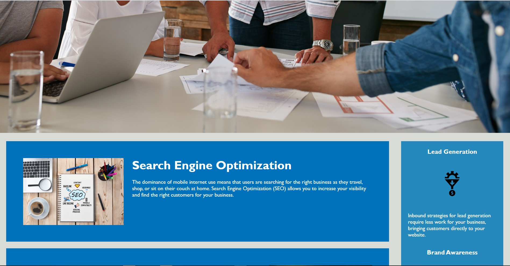
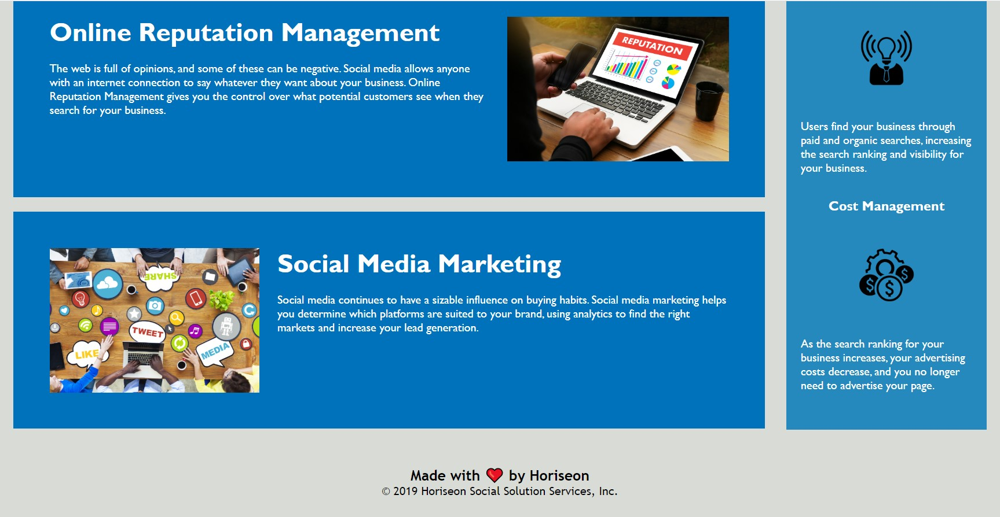

# Horiseon-project

## Challenge Description:
* Made page accessible by adding "alt" elements to images. Also added color contrast to header.
* Included comment messages throughout HTML and CSS code.
* Refactored code to include semantic HTML elements and a logical structure of said elements.
* Added descriptive title and ensured link functionality.

## Screenshots:

## Links:
### Link to Deployed Application:
* https://jenlpac.github.io/Horiseon-project/
### Link to GitHub project:
* https://github.com/jenlpac/Horiseon-project
